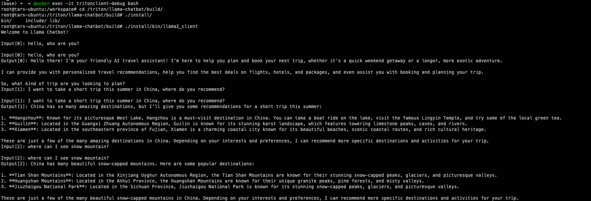

# llama-chatbot


# client


## build command

```bash
mkdir build
cd build
cmake -DCMAKE_BUILD_TYPE=Debug -DCMAKE_INSTALL_PREFIX=`pwd`/install ..
make -j40 cc-clients
```

> Note: you might want to config proxy settings if you encountered network issues during the build process. You can do this by setting the `http_proxy` and `https_proxy` environment variables.


## run command

```bash
./install/bin/llama2_client
```

## demo



# server

## 地址

[model-repo](https://github.com/sunjiabin17/tensorrtllm_backend/tree/dev-llama3/all_models/inflight_batcher_llm)

> 需要将llama3的engine模型放到`all_models/inflight_batcher_llm/tensorrt_llm/1/`下

